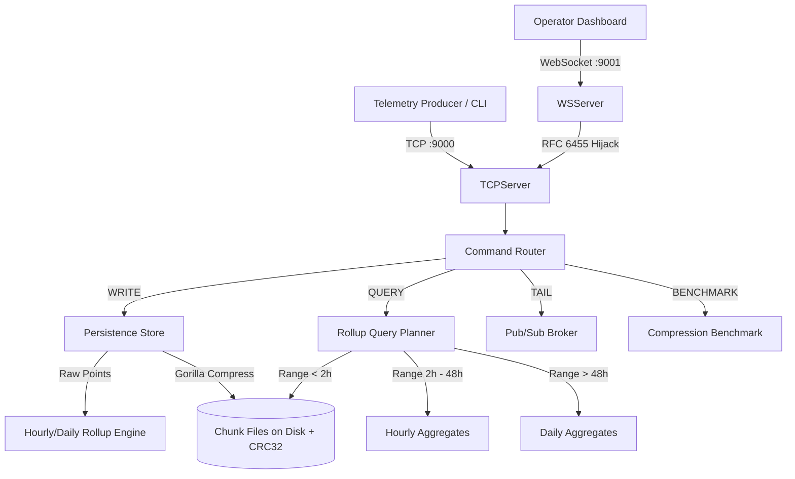

# Chronos ⏱️

> **Zero-Dependency, Gorilla-Style Time-Series Database & Operator Dashboard**  
> Built for the **Zero Dependency 2026 Hackathon** (Track D: Data & Storage).  
> **100% Standard Library** — Zero third-party Go packages, zero npm packages, zero external CDNs.

---

## 🌟 Highlights

- **🦍 Gorilla Compression Engine**: Implements the Facebook Gorilla time-series compression paper. Delta-of-delta timestamp encoding and leading/trailing zero XOR IEEE 754 float compression achieving up to **10–15× compression ratio** (~1.37 bytes/point).
- **🛡️ Crash-Safe Persistence**: Chunk rotation with CRC32 IEEE data checksums, atomic directory renames, and atomic snapshot-read indexes.
- **⚡ Tier-Aware Rollup Engine**: Precomputed hourly and daily aggregates (`avg`, `min`, `max`, `count`) with an automatic query planner selecting the optimal resolution tier.
- **🔌 Dual-Interface Server**: High-throughput raw TCP line-protocol server (`:9000`) and a pure Go stdlib RFC 6455 WebSocket gateway (`:9001`) with SHA-1 handshake and bit-level framing.
- **📊 Operator Dashboard**: High-fidelity dark mode operator UI featuring real-time Canvas 2D charting, live `TAIL` telemetry subscription, interactive write/query consoles, and live benchmark suite.

---

## 📁 Repository Structure

```
chronos/
├── README.md                                  ← Project overview and quick start guide
├── chronos-complete-implementation-report.md  ← Full engineering spec & design report
│
├── backend/                                   ← Zero-dependency Go TSDB core
│   ├── go.mod                                 ← Module definition (pure Go stdlib, go 1.21)
│   ├── main.go                                ← Server entry point (starts TCP :9000 & WS :9001)
│   ├── config/
│   │   └── config.go                          ← Tuning constants, chunk limits, and ports
│   ├── compression/                           ← CHUNK 1: Gorilla compression engine
│   │   ├── compression.go                     ← BitWriter/BitReader, DoD, XOR float compression
│   │   └── compression_test.go                ← Comprehensive unit tests & fuzzing suite
│   ├── persistence/                           ← CHUNK 2: Storage and crash recovery
│   │   └── store.go                           ← Chunk files, CRC32 validation, atomic index
│   ├── rollup/                                ← CHUNK 3: Tier rollups & query planner
│   │   └── engine.go                          ← Hourly & daily rollups, resolution selector
│   └── server/                                ← CHUNK 4: Networking and protocol
│       ├── server.go                          ← TCP line protocol (WRITE, QUERY, TAIL, BENCHMARK)
│       ├── websocket.go                       ← Pure stdlib RFC 6455 WebSocket server
│       └── benchmark.go                       ← Live compression benchmark runner
│
└── ui/                                        ← Frontend Operator Dashboard
    ├── index.html                             ← Dashboard UI layout
    ├── style.css                              ← Monochrome design system & responsive layout
    ├── app.js                                 ← WebSocket client, Canvas chart & demo simulator
    └── README.md                              ← Frontend-specific documentation
```

---

## 🚀 Quick Start

### 1. Prerequisites
- **Go 1.21+** (for the backend)
- **Modern Web Browser** (Chrome, Firefox, Safari, Edge)
- *No npm, yarn, Docker, or external packages required.*

---

### 2. Running the Backend Server

```bash
# Navigate to the backend directory
cd backend

# Run all unit tests and compression benchmarks
go test -v ./...

# Start the Chronos server with live API ingestion (weather, crypto, forex)
go run main.go

# (Option A) Run with synthetic demo mode (offline, zero network required)
go run main.go -demo
# OR via environment variable:
CHRONOS_DEMO_MODE=1 go run main.go

# (Option B) Run with custom data directory or disable ingestion
go run main.go -data /path/to/data -ingest=false
```

Once running:
- **TCP Server**: `localhost:9000` (for CLI / telemetry ingest)
- **WebSocket Gateway**: `ws://localhost:9001/ws` (for the browser dashboard)
- **Health Check**: `http://localhost:9001/health`
- **Graceful Shutdown**: Pressing `Ctrl+C` (SIGINT/SIGTERM) automatically flushes all in-memory series buffers and finalizes open hourly rollup accumulators to disk before exiting.

---

### 3. Running the Operator Dashboard

The frontend requires zero build steps or bundlers:

```bash
# Option A: Open index.html directly in your browser
# Windows:
start ui/index.html
# macOS:
open ui/index.html
# Linux:
xdg-open ui/index.html

# Option B: Serve via Python stdlib HTTP server
cd ui
python -m http.server 8080
# Open http://localhost:8080 in your browser
```

> **Note**: The backend supports offline **Synthetic Demo Mode** (`-demo` or `CHRONOS_DEMO_MODE=1`) which feeds deterministic sinusoidal data through the exact same storage and alert evaluation path without needing internet connectivity. The UI also features an automatic fallback **Simulation Demo Mode** if the Go backend is not connected.

---

## 📡 Line Protocol & API Reference

Chronos uses an ultra-lean ASCII line protocol over TCP and WebSocket text frames.

### Commands

| Command | Format | Description | Example |
|---|---|---|---|
| `WRITE` | `WRITE <series> <unix_ts> <value>\n` | Append a point to a series | `WRITE cpu_usage 1735000000 78.45` |
| `QUERY` | `QUERY <series> <start_ts> <end_ts>\n` | Query range with auto-tier selection | `QUERY cpu_usage 1735000000 1735086400` |
| `TAIL` | `TAIL <series>\n` | Subscribe to live streamed writes | `TAIL cpu_usage` |
| `BENCHMARK` | `BENCHMARK\n` | Execute Gorilla compression benchmark | `BENCHMARK` |

### Responses

- **Write Success**: `OK\n`
- **Write Error**: `ERR <reason>\n`
- **Query (Raw Points)**: Multiple lines of `<ts>,<value>\n` terminated by `END\n`
- **Query (Rollups)**: Multiple lines of `<window_start>,<avg>,<min>,<max>,<count>\n` terminated by `END\n`
- **Tail Stream**: Streams `<ts>,<value>\n` in real-time as points are written

---

## 🔬 Core Architecture



### 1. Gorilla Compression Algorithm
- **Timestamps**: Uses Delta-of-Delta (DoD) variable-bit encoding:
  - $D = (t_n - t_{n-1}) - (t_{n-1} - t_{n-2})$
  - $D = 0 \rightarrow \text{bit } 0$ (1 bit)
  - $-63 \le D \le 64 \rightarrow \text{bits } 10 + 7 \text{ bits}$ (9 bits)
  - $-255 \le D \le 256 \rightarrow \text{bits } 110 + 9 \text{ bits}$ (12 bits)
  - $-2047 \le D \le 2048 \rightarrow \text{bits } 1110 + 12 \text{ bits}$ (16 bits)
  - Otherwise $\rightarrow \text{bits } 1111 + 32 \text{ bits}$ (36 bits)
- **Values**: Bitwise XOR with previous IEEE 754 `float64`:
  - $\text{XOR} = 0 \rightarrow \text{bit } 0$ (1 bit)
  - Leading/trailing zero variable bit encoding if non-zero (saving ~80-90% space on steady metrics).

### 2. Zero-Dependency RFC 6455 WebSocket Implementation
Implemented entirely using standard Go packages `crypto/sha1`, `encoding/base64`, `net/http`, and `bufio`:
- HTTP Hijacker connection upgrade with Sec-WebSocket-Accept handshake.
- Frame parsing and unmasking directly within `io.Reader` wrapper `net.Conn` compatible interface.

---

## 🧪 Verification & Testing

Run the test suite across all subsystems:

```bash
cd backend
go test -v ./...
```

Run benchmarks for compression:
```bash
go test -bench=. ./compression
```

---

## 📜 License & Compliance

Developed for the **Zero Dependency Hackathon 2026**.  
Built strictly using official standard libraries without any external dependencies or external assets.
